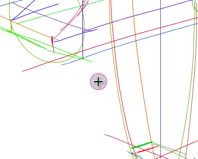
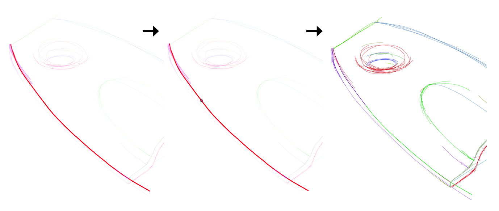
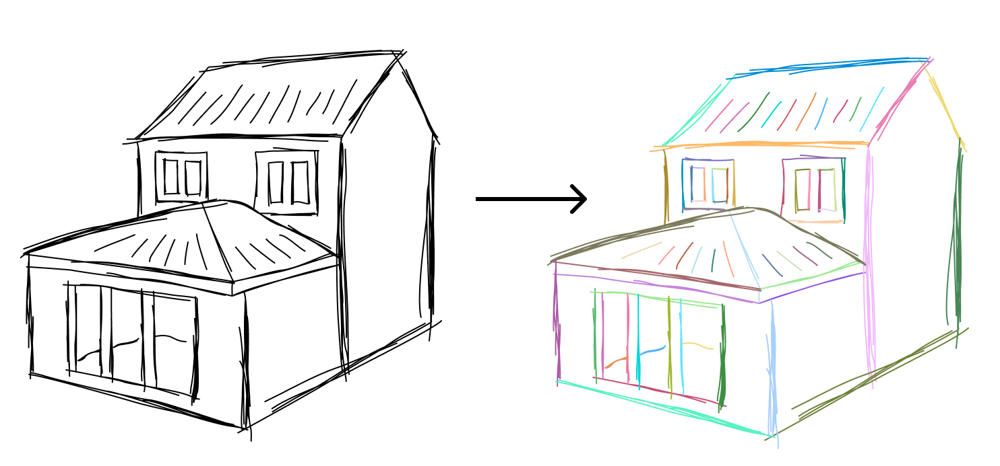

# Stroke Aggregator Labelling

## 1. Labelling Task

Group strokes together that you feel were intended to depict the same intended curve.

## 2. Example

Each group of strokes represents the same smooth curve. If it looks like two curves come together at a sharp intersection, they should be separate groups. In areas of the sketch where the strokes are used for shading, whole patches of shading should be grouped together independently from the non-shading lines in the drawing.

## 3. Using the Labeller

You can label a sketch by making a **selection** and then performing an **operation** on it.

Your main tool is your **brush**. Its size can be changed in the top menu of the labeller.

{width=40%}

To select a group of curves, use your brush to click on any curve in the group. The whole group will turn black to indicate that it is selected.

Once you select a group of strokes, there are three operations you can perform:

- **Merge**, for combining two groups of strokes into one
- **Split**, for removing some curves of one group and turning them into their own group
  - **Break**, a subset of split mode, for splitting a single curve into two curves that can then be independently grouped

At any point, hitting the escape exits current operation and deselects the currently selected group. The undo and redo buttons or Ctrl-Z and Ctrl-Y keyboard shortcuts can be used to step back and forward through the history of operations.

### 3.1 Merge Operation

When a group is selected, pressing the 1 key enters merge mode. In this mode, every time you click, every group with a curve under the brush gets added to the selected group.

### 3.2 Split Operation

When a group is selected, press the 2 key to enter split mode. You then need to make a **sub-selection** of curves in the selected group which you intend to split off into its own group. Every time you click, all the curves under the brush toggle whether or not they are sub-selected. The sub-selected curves appear pink.

#### 3.2.1 Splitting Whole Curves

With a sub-selection made, pressing the 3 key finalizes the split and turns the sub-selection into its own group.

#### 3.2.2 Breaking a Curve

If a sub-selection contains only one curve, press the 4 key to break the curve into two curves. A red dot will appear on the curve showing where the break will happen. Move the mouse left and right to change the position of the break point. Pressing the 4 key a second time confirms the break, creating two curves out of the sub-selection, each one in its own new group.

### 3.3 Saving

When you are satisfied with your groupings, click the button at the bottom of the right sidebar labelled "I'm done, save my groupings." This will download **two files** for each drawing you label. Your browser may ask you for permission to download multiple files. Make sure to accept this.

## 4. Additional Examples

